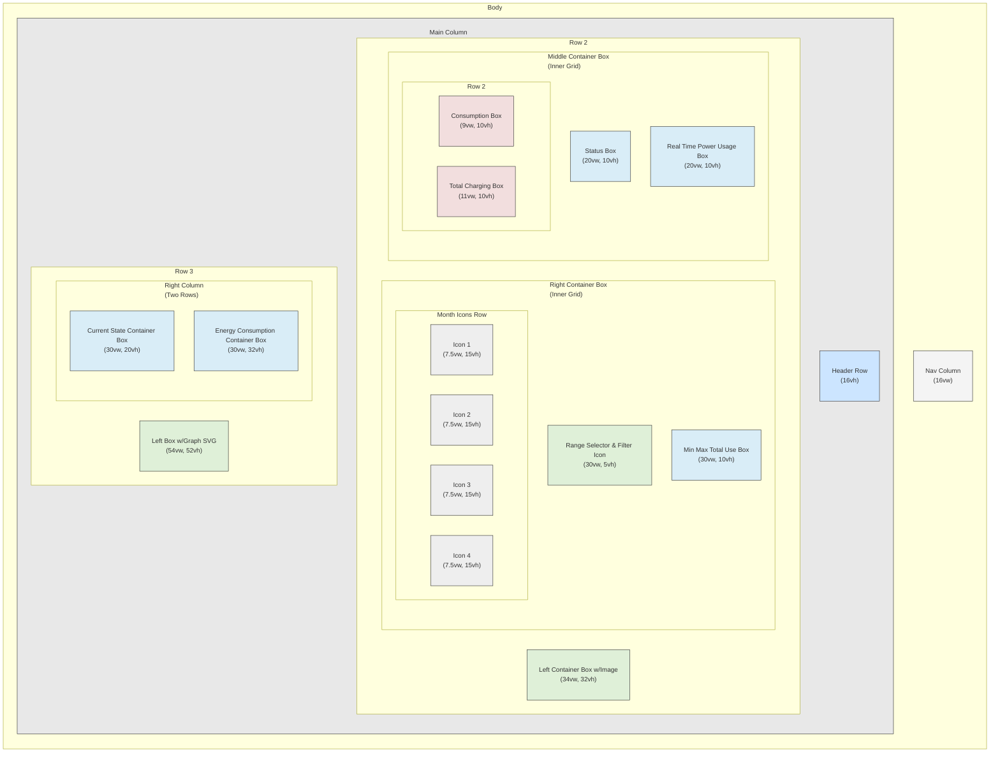

# Team2Oblig1



***

```plaintext
/*

****body*******************************************************************************************************************************************************************
* | nav col | main col                                                                                                                                                  | *
* | c-1     | c-2                                                                                                                                                       | *
* | (16vw)  | |-------------------------------------------------------------------------------------------------------------------------------------------------------| | *
* |         | | article container                                                                                                                                     | | *
* |         | | |---------------------------------------------------------------------------------------------------------------------------------------------------| | | *
* |         | | | header row                                                                                                                                        | | | *
* |         | | | c-2-r-1 (16vh)                                                                                                                                    | | | *
* |         | | |---------------------------------------------------------------------------------------------------------------------------------------------------| | | *
* |         | | | left container box w/image | middle container box w/ small status boxes   | right container box w/filter selection and month icon boxes           | | | *
* |         | | | c-2-r-2-c-1-b (34vw, 32vh) | c-2-r-2-c-2 has inner grid layout            | c-2-r-2-c-3 has inner grid layout                                     | | | *
* |         | | |                            | |------------------------------------------| | |-------------------------------------------------------------------| | | | *
* |         | | |                            | | status box                               | | | range selector and filter icon strip/box                          | | | | *
* |         | | |                            | | c2-ig-r1-b                               | | | c3-ig-r1                                                          | | | | *
* |         | | |                            | | (20vw, 10vh)                             | | | (30vw, 5vh)                                                       | | | | *
* |         | | |                            | |------------------------------------------| | |-------------------------------------------------------------------| | | | *
* |         | | |                            | | consumption box    | total charging box  | | | month icons                                                       | | | | *
* |         | | |                            | | c2-ig-r2c1-b       | c2-ig-r2c2-b        | | | |---------------|---------------|---------------|---------------| | | | | *
* |         | | |                            | | (9vw, 10vh)        | (11vw, 10vh)        | | | | icon-1        | icon-2        | icon-3        | icon-4        | | | | | *
* |         | | |                            | |                    |                     | | | | c3-ig-r2-c1-b | c3-ig-r2-c2-b | c3-ig-r2-c3-b | c3-ig-r2-c4-b | | | | | *
* |         | | |                            | |                    |                     | | | | (7.5vw, 15vh) | (7.5vw, 15vh) | (7.5vw, 15vh) | (7.5vw, 15vh) | | | | | *
* |         | | |                            | |                    |                     | | | |---------------|---------------|---------------|---------------| | | | | *
* |         | | |                            | |------------------------------------------| | |-------------------------------------------------------------------| | | | *
* |         | | |                            | | real time power usage box                | | | min max total use box                                             | | | | *
* |         | | |                            | | c2-ig-r3-b                               | | |  c3-ig-r3-b                                                       | | | | *
* |         | | |                            | | (20vw, 10vh)                             | | |  (30vw, 10vh)                                                     | | | | *
* |         | | |                            | |------------------------------------------| | |-------------------------------------------------------------------| | | | *
* |         | | |---------------------------------------------------------------------------------------------------------------------------------------------------| | | *
* |         | | | left box w/graph svg                                                      | right column w/ 2 rows for 2 container boxes (30vw, 52vh)             | | | *
* |         | | | c-2-r-3-c-1-b                                                             | |-------------------------------------------------------------------| | | | *
* |         | | | (54vw, 52vh)                                                              | | current state container box (30vw, 20vh)                          | | | | *
* |         | | |                                                                           | | c-2-r-3-c-2-r-1-b                                                 | | | | *
* |         | | |                                                                           | |-------------------------------------------------------------------| | | | *
* |         | | |                                                                           | | energy consumption container box (30vw, 32vh)                     | | | | *
* |         | | |                                                                           | | c-2-r-3-c-2-r-2-b                                                 | | | | *
* |         | | |---------------------------------------------------------------------------|-----------------------------------------------------------------------| | | *
* |         | |-------------------------------------------------------------------------------------------------------------------------------------------------------| | *
* |         |                                                                                                                                                           | *
***************************************************************************************************************************************************************************
*/
```
